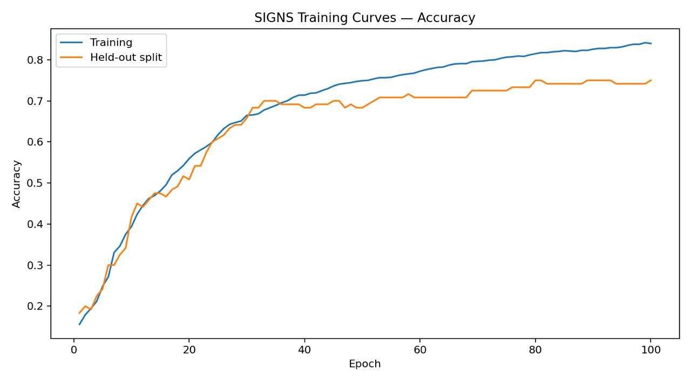
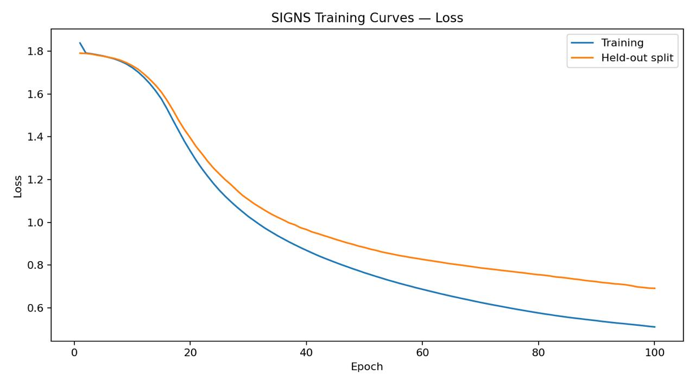

# CNN Image Classification with TensorFlow and Keras

A practical Convolutional Neural Network (CNN) project implementing image classification with TensorFlow/Keras. The project demonstrates both the **Sequential API** and the **Functional API** through two image-classification tasks: binary classification on the Happy House dataset and multiclass classification on the SIGNS dataset.

> **Course:** Deep Learning Specialization — Convolutional Neural Networks  
> **Course:** Course 4, Week 1 Assignment  
> **Institution:** DeepLearning.AI  
> **Instructor:** Andrew Ng  
> **Framework:** TensorFlow / Keras

---

## 📌 Project Overview

This project focuses on building and training Convolutional Neural Networks for image classification.

The notebook contains two separate CNN applications:

1. **Happy House Classification**
   - Binary image classification
   - Determines whether an image represents a person making a "happy" gesture.
   - Implemented using the **Keras Sequential API**.

2. **SIGNS Classification**
   - Multiclass image classification
   - Recognizes hand signs corresponding to six different classes.
   - Implemented using the **Keras Functional API**.

The project covers the complete CNN workflow:

**Input Images → Convolution → Activation → Pooling → Flattening → Fully Connected Layer → Prediction**

It also demonstrates important deep-learning concepts such as convolution, pooling, padding, batch normalization, activation functions, softmax classification, model compilation, training, evaluation, and learning-curve analysis.

---

## 🎯 Objectives

The main objectives of this project are to:

- Understand how CNNs process image data.
- Build CNN architectures using TensorFlow/Keras.
- Use the **Sequential API** for a straightforward layer-by-layer architecture.
- Use the **Functional API** for more flexible neural-network construction.
- Apply convolutional layers to extract spatial features from images.
- Use pooling layers to reduce spatial dimensions.
- Use ReLU activations to introduce non-linearity.
- Use batch normalization to normalize intermediate activations.
- Build binary and multiclass classification models.
- Train CNN models using Adam optimization.
- Analyze training and held-out performance using loss and accuracy curves.
- Understand the difference between binary and multiclass classification outputs.

---

# 🧠 Concepts Demonstrated

## Convolutional Neural Networks

A CNN is designed to process structured grid-like data such as images.

Instead of connecting every pixel directly to every neuron, convolutional layers use small learnable filters to detect local patterns such as:

- edges
- textures
- shapes
- increasingly complex visual features

A typical CNN pipeline used in this project is:

```text
Input Image
     ↓
Convolution
     ↓
ReLU
     ↓
Pooling
     ↓
Convolution
     ↓
ReLU
     ↓
Pooling
     ↓
Flatten
     ↓
Dense Layer
     ↓
Prediction
```

---

## 🔲 Convolution

A convolutional layer applies learnable filters to an image.

For example:

```text
Input
64 × 64 × 3

      ↓ Convolution

Feature Maps
64 × 64 × number_of_filters
```

The three channels in the input represent:

```text
Red
Green
Blue
```

The convolution filters learn useful visual patterns automatically during training.

---

## 📉 Pooling

Pooling reduces the spatial dimensions of feature maps.

For example, a `2 × 2` max-pooling operation reduces:

```text
64 × 64
```

to approximately:

```text
32 × 32
```

when using a stride of 2.

Pooling helps reduce computational cost and makes the learned representation less sensitive to small spatial changes.

This project uses different pooling configurations for the two models.

---

## ⚡ ReLU

The Rectified Linear Unit is used as the activation function after convolution:

```text
ReLU(x) = max(0, x)
```

It introduces non-linearity into the network, allowing the CNN to learn more complex patterns.

---

## 🧮 Batch Normalization

The Happy House model uses:

```python
BatchNormalization(axis=3)
```

Because the images use the channels-last format:

```text
(batch, height, width, channels)
```

`axis=3` corresponds to the channel dimension.

Batch normalization helps stabilize the activations during training.

---

# 🏠 Model 1 — Happy House

## Task

The first model performs **binary classification**.

The objective is to classify images into two categories:

```text
Happy House
     ↓
Binary Prediction
     ↓
0 or 1
```

The output layer therefore contains a single neuron with a sigmoid activation.

---

## Dataset

The Happy House dataset contains:

| Property | Value |
|---|---:|
| Training examples | 600 |
| Test examples | 150 |
| Image size | 64 × 64 |
| Channels | 3 |
| Input shape | `(64, 64, 3)` |
| Number of classes | 2 |

The corresponding label shapes are:

```text
Y_train → (600, 1)
Y_test  → (150, 1)
```

Because this is a binary-classification task, a single sigmoid output is used.

---

## Architecture

The model is constructed using the **Keras Sequential API**.

```text
Input
(64, 64, 3)
      │
      ▼
ZeroPadding2D
padding = (3, 3)
      │
      ▼
Conv2D
32 filters
7 × 7 kernel
stride = 1
      │
      ▼
Batch Normalization
      │
      ▼
ReLU
      │
      ▼
MaxPooling2D
2 × 2
stride = 2
      │
      ▼
Flatten
      │
      ▼
Dense
1 unit
sigmoid
      │
      ▼
Binary Prediction
```

---

## Keras Implementation

```python
model = tf.keras.Sequential([
    ZeroPadding2D(padding=(3, 3), input_shape=(64, 64, 3)),
    Conv2D(32, (7, 7), strides=(1, 1)),
    BatchNormalization(axis=3),
    ReLU(),
    MaxPooling2D(),
    Flatten(),
    Dense(1, activation="sigmoid")
])
```

---

## Model Configuration

The model is compiled using:

```python
optimizer = Adam
loss = binary_crossentropy
metric = accuracy
```

Conceptually:

```text
Binary classification
        ↓
Sigmoid output
        ↓
Binary Cross-Entropy
        ↓
Adam optimizer
        ↓
Accuracy metric
```

---

## Training Configuration

The notebook trains the model using:

```text
Epochs:      10
Batch size:  16
```

The model is trained on 600 training images and evaluated on 150 test images.

---

## Happy House Result

The recorded evaluation result is:

| Metric | Result |
|---|---:|
| Test Loss | 1.318354... |
| Test Accuracy | **66.0%** |

The recorded accuracy is therefore:

```text
66.0%
```

This result reflects the specific training run stored in the notebook.

---

# ✋ Model 2 — SIGNS

## Task

The second model performs **multiclass classification**.

The SIGNS dataset contains images representing six different hand-sign classes.

The model therefore produces six output probabilities:

```text
Class 1
Class 2
Class 3
Class 4
Class 5
Class 6
```

The predicted class is the class with the highest probability.

---

## Dataset

The SIGNS dataset contains:

| Property | Value |
|---|---:|
| Training examples | 1080 |
| Test examples | 120 |
| Image size | 64 × 64 |
| Channels | 3 |
| Input shape | `(64, 64, 3)` |
| Number of classes | 6 |

The one-hot label shapes are:

```text
Y_train → (1080, 6)
Y_test  → (120, 6)
```

Because this is a six-class classification problem, the output layer contains six neurons.

---

# 🔧 SIGNS Architecture

The SIGNS model is implemented using the **Keras Functional API**.

```text
Input
(64, 64, 3)
      │
      ▼
Conv2D
8 filters
4 × 4 kernel
stride = 1
padding = same
      │
      ▼
ReLU
      │
      ▼
MaxPooling2D
8 × 8
stride = 8
padding = same
      │
      ▼
Conv2D
16 filters
2 × 2 kernel
stride = 1
padding = same
      │
      ▼
ReLU
      │
      ▼
MaxPooling2D
4 × 4
stride = 4
padding = same
      │
      ▼
Flatten
      │
      ▼
Dense
6 units
softmax
      │
      ▼
6-Class Prediction
```

---

## Keras Implementation

The Functional API allows the input and output tensors to be connected explicitly:

```python
def convolutional_model(input_shape):
    input_img = Input(shape=input_shape)

    Z1 = Conv2D(
        8,
        (4, 4),
        strides=1,
        padding="same"
    )(input_img)

    A1 = ReLU()(Z1)

    P1 = MaxPooling2D(
        (8, 8),
        strides=8,
        padding="same"
    )(A1)

    Z2 = Conv2D(
        16,
        (2, 2),
        strides=1,
        padding="same"
    )(P1)

    A2 = ReLU()(Z2)

    P2 = MaxPooling2D(
        (4, 4),
        strides=4,
        padding="same"
    )(A2)

    F = Flatten()(P2)

    outputs = Dense(
        6,
        activation="softmax"
    )(F)

    model = Model(
        inputs=input_img,
        outputs=outputs
    )

    return model
```

---

# 📐 SIGNS Dimension Flow

The model changes the feature-map dimensions as follows:

```text
Input
64 × 64 × 3

      ↓ Conv2D, SAME

64 × 64 × 8

      ↓ MaxPooling
      pool = 8 × 8
      stride = 8

8 × 8 × 8

      ↓ Conv2D, SAME

8 × 8 × 16

      ↓ MaxPooling
      pool = 4 × 4
      stride = 4

2 × 2 × 16

      ↓ Flatten

64

      ↓ Dense(6)

6
```

The flattening calculation is:

```text
2 × 2 × 16 = 64
```

Therefore, the Dense layer receives 64 inputs.

---

# 📊 SIGNS Model Parameters

The recorded model summary contains:

| Layer | Output Shape | Parameters |
|---|---|---:|
| InputLayer | `(None, 64, 64, 3)` | 0 |
| Conv2D | `(None, 64, 64, 8)` | 392 |
| ReLU | `(None, 64, 64, 8)` | 0 |
| MaxPooling2D | `(None, 8, 8, 8)` | 0 |
| Conv2D | `(None, 8, 8, 16)` | 528 |
| ReLU | `(None, 8, 8, 16)` | 0 |
| MaxPooling2D | `(None, 2, 2, 16)` | 0 |
| Flatten | `(None, 64)` | 0 |
| Dense | `(None, 6)` | 390 |

### Total trainable parameters

```text
1,310
```

This relatively small model demonstrates that useful image representations can be learned with a compact CNN architecture.

---

# ⚙️ SIGNS Model Configuration

The model is compiled using:

```python
optimizer = Adam()
loss = "categorical_crossentropy"
metrics = ["accuracy"]
```

The reason categorical cross-entropy is used is that the labels are represented as one-hot vectors with six positions.

For example:

```text
[0, 0, 1, 0, 0, 0]
```

represents one of the six classes.

The final layer uses:

```python
Dense(6, activation="softmax")
```

Softmax converts the six outputs into probabilities whose sum is approximately 1.

---

# 🏋️ SIGNS Training

The training dataset is batched using:

```python
batch_size = 64
```

The notebook trains the model for:

```text
100 epochs
```

Training and the held-out split are passed through the TensorFlow dataset pipeline.

---

# 📈 Training Results

The notebook contains a stored training history for the SIGNS model.

The recorded history shows:

### Training accuracy

```text
Initial accuracy ≈ 15.6%
Final accuracy  ≈ 84.0%
Best accuracy   ≈ 84.2%
```

### Held-out/test-split accuracy used during training

```text
Final accuracy = 75.0%
Best accuracy  = 75.0%
```

### Final losses

```text
Training loss             ≈ 0.511
Held-out/test-split loss  ≈ 0.692
```

The training curves are included in the repository:





---

# 📌 Results Summary

| Model | Task | Dataset | Training Setup | Reported Accuracy |
|---|---|---|---|---:|
| Happy House CNN | Binary classification | Happy House | 10 epochs, batch size 16 | **66.0% test accuracy** |
| SIGNS CNN | Multiclass classification | SIGNS | 100 epochs, batch size 64 | **75.0% held-out/test-split accuracy** |

For the SIGNS model, the notebook uses the provided test split as `validation_data` during training. Therefore, the 75.0% figure should **not** be presented as a completely untouched final test evaluation in a production-style experiment.

A production workflow would normally use:

```text
Training Set
     ↓
Model Training

Validation Set
     ↓
Hyperparameter / Model Selection

Test Set
     ↓
Final Unbiased Evaluation
```

In this course assignment, the available held-out split is used during training for monitoring.

---

# 🔎 Interpretation of the Results

The SIGNS model reaches approximately 84% training accuracy while the held-out/test-split accuracy reaches 75%.

This gap indicates that the model fits the training data better than the held-out data.

This can be an indication of some degree of **overfitting**.

In other words:

```text
Training performance
        ≈ 84%

Held-out performance
        ≈ 75%
```

The model successfully learns meaningful patterns, but its performance on unseen examples is lower than its performance on the training data.

The learning curves help visualize this behavior.

---

# 🏗️ Why Two Keras APIs?

This project intentionally demonstrates two different ways of constructing neural networks.

## Sequential API

The Happy House model uses:

```python
tf.keras.Sequential(...)
```

The Sequential API is useful when the model is essentially a simple linear stack of layers:

```text
Layer 1
  ↓
Layer 2
  ↓
Layer 3
  ↓
Layer 4
```

It is simple and easy to read.

---

## Functional API

The SIGNS model uses:

```python
Input(...)
Model(inputs=..., outputs=...)
```

The Functional API explicitly represents the flow between tensors.

It is more flexible and is useful for models involving:

- multiple inputs
- multiple outputs
- branches
- skip connections
- shared layers
- more complex architectures

Using both APIs in this project demonstrates familiarity with the two major Keras model-building approaches.

---

# 🧪 Preprocessing

The project prepares the image datasets before feeding them into the CNNs.

The images are stored as RGB images with dimensions:

```text
64 × 64 × 3
```

The dataset arrays are organized so that the CNN receives image tensors in channels-last format:

```text
(batch, height, width, channels)
```

The target labels are represented differently depending on the problem:

### Binary classification

```text
(600, 1)
(150, 1)
```

### Multiclass classification

```text
(1080, 6)
(120, 6)
```

The SIGNS labels are one-hot encoded because the model uses categorical cross-entropy.

---

# 🧮 Loss Functions

The two models use different loss functions because they solve different classification problems.

## Happy House

Binary classification:

```python
loss="binary_crossentropy"
```

Output:

```python
Dense(1, activation="sigmoid")
```

---

## SIGNS

Multiclass classification:

```python
loss="categorical_crossentropy"
```

Output:

```python
Dense(6, activation="softmax")
```

The relationship is:

```text
Binary classification
        ↓
1 sigmoid output
        ↓
Binary cross-entropy


Multiclass classification
        ↓
6 softmax outputs
        ↓
Categorical cross-entropy
```

---

# 🛠️ Technologies Used

- Python
- TensorFlow
- Keras
- NumPy
- Pandas
- Matplotlib
- HDF5 datasets
- Jupyter Notebook
- Convolutional Neural Networks
- Deep Learning

---

# 📁 Project Structure

A clean portfolio version of the repository can use the following structure:

```text
CNN_Image_Classification/
│
├── CNN_Image_Classification.ipynb
├── README.md
├── cnn_utils.py
│
├── images/
│   ├── signs_accuracy.png
│   └── signs_loss.png
│
└── .gitignore
```

### File descriptions

| File | Purpose |
|---|---|
| `CNN_Image_Classification.ipynb` | Complete implementation, training, evaluation, and analysis |
| `cnn_utils.py` | Utility functions used by the notebook |
| `README.md` | Project documentation |
| `images/` | Training and evaluation visualizations |
| `.gitignore` | Prevents unnecessary files from being committed |

---

# ▶️ How to Run the Project

## 1. Clone the repository

```bash
git clone <YOUR_GITHUB_REPOSITORY_URL>
cd CNN_Image_Classification
```

## 2. Install dependencies

```bash
pip install tensorflow numpy pandas matplotlib h5py jupyter
```

## 3. Launch Jupyter Notebook

```bash
jupyter notebook
```

## 4. Open

```text
CNN_Image_Classification.ipynb
```

## 5. Run the notebook from beginning to end

The notebook will:

```text
Load the datasets
      ↓
Preprocess the data
      ↓
Build the CNNs
      ↓
Compile the models
      ↓
Train the models
      ↓
Evaluate performance
      ↓
Plot learning curves
```

---

# 📚 Key Learning Outcomes

Through this project, I practiced:

### CNN Fundamentals

- Convolutional filters
- Feature maps
- Kernel size
- Strides
- Padding
- Pooling
- Flattening
- Fully connected layers

### TensorFlow / Keras

- `Conv2D`
- `ZeroPadding2D`
- `BatchNormalization`
- `ReLU`
- `MaxPooling2D`
- `Flatten`
- `Dense`
- `Input`
- `Model`

### Model Building

- Sequential API
- Functional API
- Model compilation
- Adam optimization
- Binary cross-entropy
- Categorical cross-entropy
- Sigmoid activation
- Softmax activation

### Model Evaluation

- Accuracy
- Loss
- Training curves
- Held-out performance
- Overfitting analysis

---

# 📈 What the Learning Curves Show

The SIGNS training curves provide two important pieces of information.

## Accuracy curve

The training accuracy improves significantly during the 100 training epochs, reaching approximately 84%.

The held-out/test-split accuracy improves to approximately 75%.

This shows that the model learns useful patterns from the training data but does not generalize perfectly to unseen examples.

---

## Loss curve

Training loss decreases considerably during training.

The held-out/test-split loss also decreases, although it remains higher than the training loss toward the end.

This difference is consistent with the observed gap between training and held-out performance.

---

# ⚠️ Reproducibility Note

The notebook is an educational/course notebook and contains some saved execution-state inconsistencies.

In particular, the notebook includes a recorded shape-mismatch error during one SIGNS training execution:

```text
ValueError:
Shapes (None, 1) and (None, 6) are incompatible
```

However, the notebook also contains the correct one-hot encoded SIGNS label shapes:

```text
Y_train → (1080, 6)
Y_test  → (120, 6)
```

and contains a stored 100-epoch training history from a successful model run.

Therefore, the reported SIGNS learning curves in this README are explicitly described as coming from the **stored training history** rather than claiming that every saved notebook cell executes cleanly in its current state.

For a polished portfolio repository, the notebook should ideally be restarted and executed from the beginning in a clean kernel before publishing the final version.

---

# 🎓 Course Attribution

This project was developed as part of the:

**Deep Learning Specialization**

**Course 4 — Convolutional Neural Networks**

by **DeepLearning.AI**

Instructor:

**Andrew Ng**

The project is an educational implementation based on the course assignment and learning material.

This repository is intended to demonstrate my understanding and implementation of CNN concepts using TensorFlow/Keras.

All original course materials, datasets, utilities, and instructional assets should be shared publicly only in accordance with the applicable course/platform terms.

---

# 🚀 Possible Future Improvements

Several improvements could make the models stronger and the experiment more production-oriented:

- Add data augmentation.
- Add additional convolutional blocks.
- Tune the number and size of filters.
- Experiment with dropout.
- Use a separate validation set.
- Keep the test set untouched until final evaluation.
- Add a confusion matrix for the SIGNS classifier.
- Report precision, recall, and F1-score.
- Add example predictions.
- Compare the custom CNN with a transfer-learning model such as MobileNet or ResNet.
- Add reproducible random seeds.
- Save trained model weights.
- Add a requirements file for dependency management.

---

# 📌 Project Takeaway

This project demonstrates the fundamental workflow for building CNN image classifiers with TensorFlow and Keras.

The two implementations show how the same core CNN concepts can be expressed using different Keras APIs:

```text
Sequential API
     ↓
Simple layer-by-layer models


Functional API
     ↓
More flexible computational graphs
```

The project also demonstrates the complete deep-learning workflow:

```text
Dataset
   ↓
Preprocessing
   ↓
CNN Architecture
   ↓
Compilation
   ↓
Training
   ↓
Evaluation
   ↓
Learning Curves
   ↓
Performance Analysis
```

The final models achieved:

```text
Happy House
66.0% test accuracy


SIGNS
75.0% held-out/test-split accuracy
```

with the SIGNS model reaching approximately:

```text
84.0% training accuracy
```

This project provided practical experience with convolutional neural networks, TensorFlow/Keras model construction, binary and multiclass classification, and interpreting model performance.

---

## ⭐ Credits

**DeepLearning.AI — Deep Learning Specialization**

**Instructor:** Andrew Ng

**Course:** Convolutional Neural Networks

This repository is maintained as an educational portfolio project demonstrating CNN implementation and understanding.